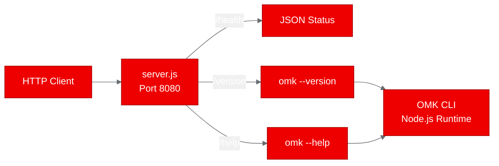

## From CLI to cluster: deploying a multi-agent coding tool on OpenShift

Agent runtimes are everywhere, but they're stuck on developer laptops. We took OMK, a TypeScript multi-agent coding tool with MCP support and DAG-based orchestration, and deployed it as a containerized service on Red Hat OpenShift AI. Here's what we learned about bringing local-first agent tools into platform-managed environments.

### What is OMK?

Open Multi-Agent Kit (OMK) is a provider-neutral multi-agent control plane for coding workflows. It supports multiple LLM providers out of the box: Anthropic, OpenAI, Google, Bedrock, Mistral, and more. The tool features DAG-based task planning, MCP protocol integration, quality gates, and runs in four modes: interactive TUI, print, JSON, and headless RPC.

OMK is built as a TypeScript monorepo with five npm workspace packages: a terminal UI library, a unified LLM API layer, an agent runtime core, the main coding agent CLI, and an experimental work packet loop. The build chain compiles these sequentially using TypeScript's native Go-based compiler (`tsgo`).

### Why deploy a CLI tool on OpenShift?

Most agent frameworks today are designed for single-developer workstations. But enterprise teams need agent runtimes that run on shared infrastructure with proper resource governance, monitoring, and lifecycle management. The question isn't whether agents work locally. It's whether they survive the transition to a managed platform.

We wanted to validate three things:

1. Can a complex TypeScript monorepo build cleanly on UBI9?
2. Can a CLI-native tool be wrapped into an HTTP service for platform deployment?
3. Does the resulting container behave correctly under OpenShift's security constraints?

### Containerizing with UBI

The first challenge was the base image. OMK requires Node.js >= 22.19.0, and the UBI9 nodejs-22 image ships v22.22.2. That worked. The real friction came from the monorepo structure.

We used `registry.access.redhat.com/ubi9/nodejs-22` and created a `Dockerfile.ubi` that installs workspace dependencies, then builds each package in dependency order. A critical detail: when COPY creates directories in a Docker build, they inherit root ownership. On UBI images running as user 1001, npm can't create `node_modules` inside root-owned directories. The fix is simple but easy to miss:

```dockerfile
COPY --chown=1001:0 packages/tui/package.json packages/tui/
COPY --chown=1001:0 packages/ai/package.json packages/ai/
```

The second gotcha: OMK's `package.json` declares `"type": "module"`, so any `.js` file is treated as ESM. Our HTTP wrapper initially used CommonJS `require()` syntax, which Node.js rejected. Converting to ESM `import` statements resolved it immediately.

### The HTTP wrapper approach

Since OMK is a CLI tool with no built-in HTTP server, we created a lightweight ESM wrapper (`server.js`) that exposes three endpoints:

- `/health` returns a JSON status object
- `/version` executes `omk --version` and returns the result
- `/help` executes `omk --help` and returns the full usage text

This pattern, wrapping CLI tools with thin HTTP adapters, is a pragmatic approach for validating that non-server applications can run in containerized environments. The wrapper uses only Node.js standard library modules (`node:http`, `node:child_process`).



### Building on OpenShift

We used OpenShift's BuildConfig with binary source upload, which uploads the local repository to the cluster and builds the image on-cluster. No local container runtime needed. The build process:

1. Pull the UBI9 nodejs-22 base image
2. Install git (already present on the image)
3. Copy workspace package.json files and run `npm install`
4. Copy full source and build each package sequentially
5. Push the resulting image to `quay.io/aicatalyst/oh-my-kimi-omk:latest`

The build took about 2 minutes, with most time spent on the `npm install` (9 seconds for 343 packages) and the model catalog generation step, which fetches provider model lists from public APIs during build.

### Deploying and testing

The deployment uses a standard Kubernetes pattern: a Deployment with one replica, a ClusterIP Service on port 8080, and readiness/liveness probes hitting the `/health` endpoint. Resource allocation is a medium profile: 1Gi memory request, 2Gi limit.

All three test scenarios passed:

| Scenario | Result | Duration | Detail |
|----------|--------|----------|--------|
| Health check | PASS | 0.02s | `{"status":"ok","service":"omk-poc"}` |
| Version check | PASS | 2.09s | Version `0.90.3` confirmed |
| Help output | PASS | 2.87s | Full CLI usage text returned |

The version and help endpoints take 2-3 seconds because they spawn a child process to execute the OMK CLI. This overhead is acceptable for validation purposes but would need optimization for production use.

### Challenges and solutions

The PoC surfaced four issues, all resolvable:

1. **Directory permissions in UBI containers.** COPY creates root-owned directories. Fix: `--chown=1001:0` on every COPY directive.
2. **ESM vs CommonJS conflict.** The monorepo uses `"type": "module"`. Fix: use `import` syntax in the HTTP wrapper.
3. **Quay registry authentication.** The push secret needed `$oauthtoken` as the username format. Fix: update the secret with the correct credential format.
4. **Image pull permissions.** The Quay repository defaulted to private. Fix: set repository visibility to public via the Quay API.

None of these are OMK-specific. They're common patterns that apply to any TypeScript monorepo deployed on OpenShift with UBI images.

### What this proves

This PoC validates that modern TypeScript agent runtimes, even those designed exclusively for local CLI use, can be containerized with UBI images and deployed on Red Hat OpenShift AI. The MCP protocol support in OMK makes it architecturally compatible with the broader agentic AI ecosystem. With a proper RPC-over-HTTP adapter, the tool could serve as a platform-managed agent backend.

The broader lesson: the gap between "works on my laptop" and "runs on the platform" is smaller than it looks, if you have the right containerization patterns and build pipeline.

### Try it yourself

The complete PoC artifacts are available at [github.com/aicatalyst-team/oh-my-kimi](https://github.com/aicatalyst-team/oh-my-kimi) on the `autopoc-artifacts` branch. You'll find the UBI Dockerfile, Kubernetes manifests, test script, and the full PoC report.

To deploy on your own cluster:

```bash
git clone https://github.com/aicatalyst-team/oh-my-kimi
cd oh-my-kimi
kubectl apply -f kubernetes/
```
