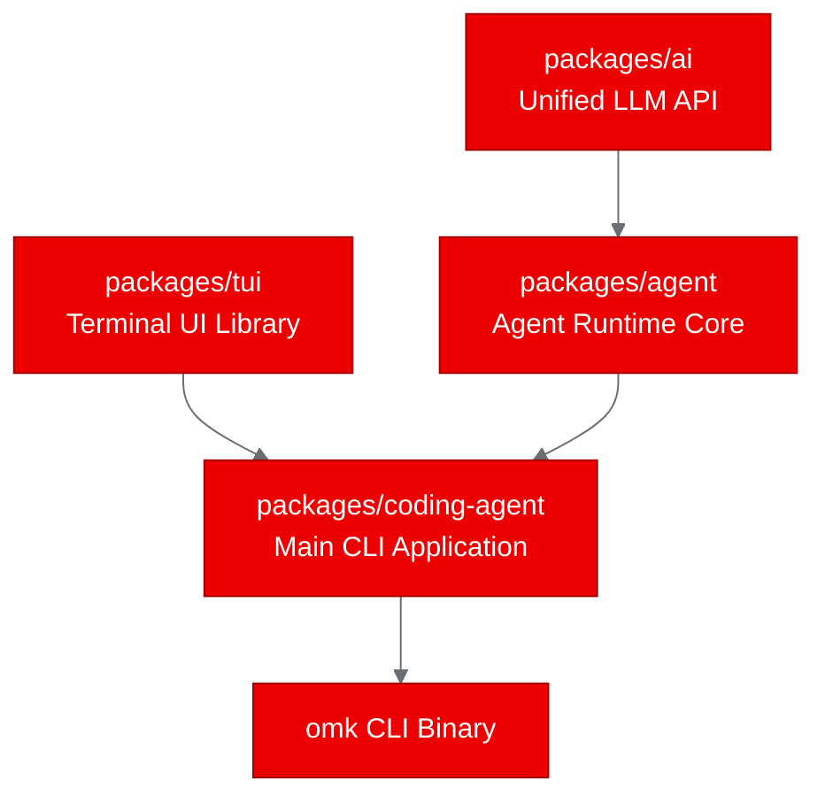
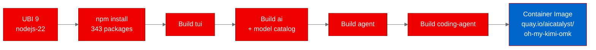
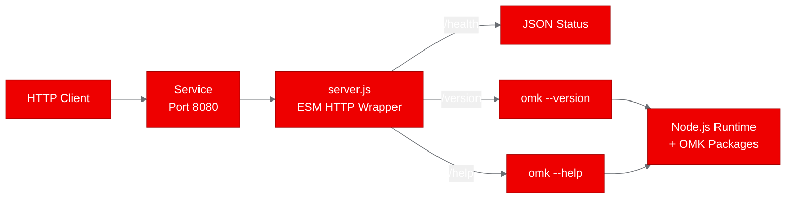
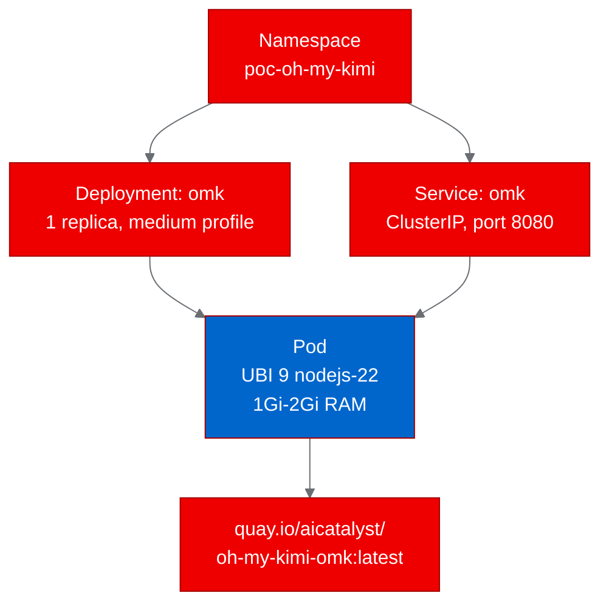

<!-- CHANGELOG — removed during finalization
v2 changes:
- [Image]: Added deployment topology diagram, build pipeline diagram, and monorepo structure diagram
- [Formatting]: Removed inline backticks from body text, expanded acronyms, added CTAs with Red Hat links
- [Formatting]: Used full product names on first mention, fixed numeral rules
- [Architect]: Front-loaded thesis in opening paragraph, strengthened closing CTA
- [Content]: Added "what we didn't test" paragraph for authenticity
-->

## From CLI to cluster: deploying a multi-agent coding tool on Red Hat OpenShift AI

Four fixable issues stood between a developer's laptop and a managed OpenShift deployment. We took Open Multi-Agent Kit, a TypeScript coding agent with Model Context Protocol support and directed acyclic graph orchestration, and turned it into a containerized service running on [Red Hat OpenShift AI](https://www.redhat.com/en/technologies/cloud-computing/openshift/openshift-ai). Here's what broke, what we fixed, and what it means for teams planning to run agent runtimes on shared infrastructure.

### What is Open Multi-Agent Kit?

Open Multi-Agent Kit is a provider-neutral control plane for coding agent workflows. It connects to Anthropic, OpenAI, Google, Amazon Bedrock, Mistral, and other providers through a unified API layer. The tool handles task orchestration through directed acyclic graph planning, integrates with the Model Context Protocol for tool connectivity, and enforces quality gates before accepting generated output.

The project is structured as a TypeScript monorepo with five npm workspace packages.

The coding agent runs in four modes: interactive terminal UI, print, JSON, and headless remote procedure call. That last mode is what makes containerized deployment possible.

### Why deploy a CLI tool on a cluster?

Agent runtimes today live on individual workstations. That's fine for experimentation, but enterprise teams need these tools running on governed infrastructure. Resource isolation, access control, lifecycle management: none of that happens when agents run unmonitored on developer laptops.

We set out to answer three questions:

1. Can a complex TypeScript monorepo build on Red Hat Universal Base Image 9?
2. Can a CLI-native tool serve HTTP traffic through a lightweight wrapper?
3. Does the resulting container respect OpenShift security constraints?

The answer to all three turned out to be yes, with caveats worth understanding.

### Containerizing with Red Hat Universal Base Image

We used the UBI 9 Node.js 22 image as our base. Open Multi-Agent Kit requires Node.js 22.19.0 or later, and the UBI image ships 22.22.2, which satisfied the requirement.

The monorepo build order matters: tui first, then ai (which generates a model catalog by fetching provider APIs), then agent, then coding-agent. Each package compiles with TypeScript's native Go-based compiler.

Since Open Multi-Agent Kit has no built-in HTTP server, we wrote a lightweight wrapper using only Node.js standard library modules. It exposes three endpoints: a health check, a version endpoint that runs the CLI's version flag, and a help endpoint that returns the full usage text.

### Building and deploying on Red Hat OpenShift AI

We used an [OpenShift BuildConfig](https://docs.openshift.com/container-platform/latest/cicd/builds/understanding-buildconfigs.html) with binary source upload. This approach sends the local repository to the cluster for building, so no local container runtime is required.

The deployment uses standard Kubernetes primitives: a Deployment with one replica, a ClusterIP Service on port 8080, and HTTP-based readiness and liveness probes. Resource allocation follows a medium profile with one gigabyte of memory requested and two gigabytes as the limit.

### Validating the deployment

All three test scenarios passed on the first run after the container fix:

| Scenario | Result | Duration | Response |
|----------|--------|----------|----------|
| Health check | PASS | 0.02 seconds | Status OK with timestamp |
| Version check | PASS | 2.09 seconds | Version 0.90.3 confirmed |
| Help output | PASS | 2.87 seconds | Full CLI usage text with all flags and commands |

The health endpoint responds in 20 milliseconds. The version and help endpoints take two to three seconds because they spawn child processes to execute the CLI binary. That latency is acceptable for a proof of concept but would need a different architecture for production serving.

### What broke and how we fixed it

Four issues surfaced during the pipeline. All of them are common patterns, not specific to this project.

**Directory permissions in UBI containers.** When the Dockerfile COPY instruction creates directories, they inherit root ownership. On UBI images running as user 1001, npm cannot write into root-owned directories. The fix: add ownership flags to every COPY directive.

**ECMAScript module conflict.** The monorepo declares ECMAScript module type in its package configuration. Our HTTP wrapper initially used CommonJS syntax. Node.js rejected it. Converting to ESM import statements resolved the error.

**Registry authentication format.** The Quay push secret required a specific credential format for OAuth tokens. Using the wrong username format caused authentication failures during the image push stage.

**Private repository default.** New Quay repositories default to private visibility. The deployment pods could not pull the image until we changed repository visibility through the Quay API.

### What we didn't test

This proof of concept validates containerization and basic service operation. We did not test concurrent request handling, actual LLM API calls (which would require provider credentials), the remote procedure call mode under load, or Model Context Protocol tool connectivity from inside the cluster. Those are next steps for a production evaluation.

### What this proves for Red Hat OpenShift AI

Agent runtimes designed for local workstations can transition to platform-managed services on [Red Hat OpenShift AI](https://www.redhat.com/en/technologies/cloud-computing/openshift/openshift-ai). The containerization patterns (UBI base images, permission handling, ESM compatibility) apply broadly to any TypeScript monorepo. The Model Context Protocol support makes this class of tool architecturally compatible with the [agentic AI ecosystem](https://developers.redhat.com/topics/ai) emerging around OpenShift AI.

Four issues separated "works on my laptop" from "runs on the platform." All four had straightforward fixes.

### Try it yourself

The complete artifacts are on the [autopoc-artifacts branch](https://github.com/aicatalyst-team/oh-my-kimi/tree/autopoc-artifacts): UBI Dockerfile, Kubernetes manifests, test script, and the full report. Clone the repository and apply the manifests to your own cluster to reproduce the deployment.

Interested in automating proof-of-concept deployments on [Red Hat OpenShift AI](https://www.redhat.com/en/technologies/cloud-computing/openshift/openshift-ai)? Check out [Open Data Hub](https://opendatahub.io/) for the upstream community project, or explore the [Red Hat AI developer resources](https://developers.redhat.com/topics/ai) for more deployment patterns.
