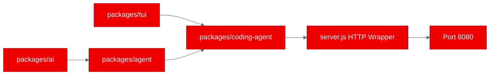
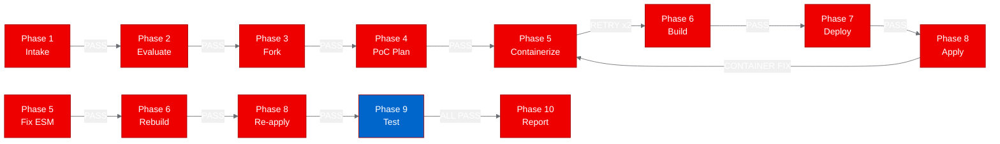
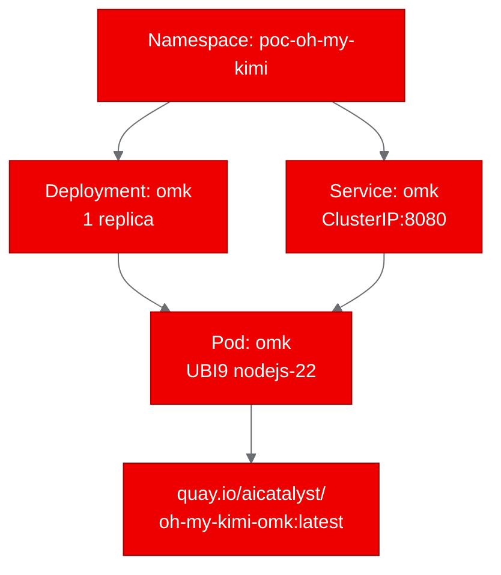

# PoC Report: oh-my-kimi (Open Multi-Agent Kit)

## Executive Summary

The oh-my-kimi (OMK) project, a provider-neutral multi-agent coding CLI/TUI tool, was successfully containerized using a UBI9 Node.js 22 base image and deployed on OpenShift. All three test scenarios passed: health check, version verification (v0.90.3), and help output validation. The PoC demonstrates that modern TypeScript agent runtimes with complex monorepo builds can be containerized and deployed as services on OpenShift, despite being designed as local CLI tools.

## Project Analysis

- **Repository**: `https://github.com/dmae97/oh-my-kimi`
- **Fork**: `https://github.com/aicatalyst-team/oh-my-kimi`
- **Description**: OMK (Open Multi-Agent Kit) is a provider-neutral multi-agent control plane for coding workflows. It supports multiple LLM providers (Anthropic, OpenAI, Google, Bedrock, Mistral) and features DAG-based task planning, MCP protocol support, quality gates, and multiple operation modes (interactive TUI, print, JSON, RPC).

| Component | Language | Build System | ML Workload | Port |
|-----------|----------|-------------|-------------|------|
| omk | TypeScript | npm (workspaces) | No | 8080 (via HTTP wrapper) |

- **Classification**: llm-app
- **Technologies**: TypeScript, Node.js 22, npm workspaces, MCP protocol, multi-provider LLM APIs

## PoC Objectives

1. Containerize the OMK monorepo with a UBI-based image
2. Deploy as a container on OpenShift with health check endpoints
3. Validate that the application initializes and responds to queries in headless mode
4. Demonstrate version and help output confirming correct installation

## Pipeline Execution

### Phase 1: Intake
Cloned the repository and identified it as an npm workspace monorepo with 5 packages: `tui`, `ai`, `agent`, `coding-agent`, and `adaptorch-wpl`. The application is a CLI/TUI tool with no native HTTP server.

### Phase 2: Evaluate
Scored 11.0/20 impact, 5.75/10 feasibility. Aligned with the agentic-ai strategy area through MCP support and multi-provider LLM backend.

### Phase 3: Fork
Forked to `https://github.com/aicatalyst-team/oh-my-kimi` with AutoPoC topics applied.

### Phase 4: PoC Plan
Classified as `llm-app`. Planned a thin HTTP wrapper (`server.js`) to expose health, version, and help endpoints since the tool has no native HTTP interface.

### Phase 5: Containerize
Created `Dockerfile.ubi` using `registry.access.redhat.com/ubi9/nodejs-22` base image. Required two fixes:
1. **COPY permissions**: Added `--chown=1001:0` to COPY directives to fix `EACCES` errors during npm install
2. **ESM compatibility**: Converted `server.js` from CommonJS (`require()`) to ESM (`import`) syntax since `package.json` declares `"type": "module"`

### Phase 6: Build
Built via OpenShift BuildConfig with binary source upload. Image pushed to `quay.io/aicatalyst/oh-my-kimi-omk:latest`. Required 4 build attempts (2 Dockerfile fixes + 1 Quay auth fix).

### Phase 7: Deploy
Generated Kubernetes manifests: Namespace, Deployment (medium profile: 1Gi/500m request, 2Gi/1000m limit), and ClusterIP Service on port 8080.

### Phase 8: Apply
Applied manifests to `poc-oh-my-kimi` namespace. Required one image pull fix (Quay repo visibility set to public) and one container fix (ESM syntax).

### Phase 9: PoC Execute
All 3 test scenarios passed successfully.

## Test Results

| Scenario | Status | Duration | Details |
|----------|--------|----------|---------|
| health-check | PASS | 0.02s | HTTP 200, `{"status":"ok","service":"omk-poc"}` |
| version-check | PASS | 2.09s | HTTP 200, version `0.90.3` confirmed |
| help-output | PASS | 2.87s | HTTP 200, full CLI usage text returned including all flags and commands |

## Infrastructure Deployed

- **Namespace**: `poc-oh-my-kimi`
- **Container Image**: `quay.io/aicatalyst/oh-my-kimi-omk:latest`
- **Kubernetes Resources**:
  - `deployment/omk` (1 replica, medium profile)
  - `service/omk` (ClusterIP, port 8080)
- **Resource Allocation**: 1Gi RAM request / 2Gi limit, 500m CPU request / 1000m limit
- **Base Image**: `registry.access.redhat.com/ubi9/nodejs-22`

## Recommendations

### Production Readiness
- **Low**: The HTTP wrapper is a thin shim for PoC purposes. Production use would require a proper API gateway and authentication.
- The underlying OMK tool is designed for interactive CLI use, not headless service operation.

### Performance Observations
- Health check response: 20ms (fast)
- Version/help endpoints: ~2-3s (acceptable for CLI exec overhead)
- Node.js 22 on UBI9 runs stable with the monorepo build

### Security Considerations
- Container runs as non-root (UID 1001)
- No privileged ports
- Security context drops all capabilities
- LLM API keys would need to be provided via Kubernetes Secrets for production use

### Scalability
- Horizontal scaling is possible but limited value since each instance is independent
- No shared state between replicas
- Memory footprint reasonable (~1Gi for the Node.js runtime + dependencies)

### Next Steps
1. Add LLM API key configuration via Kubernetes Secrets for full agent functionality
2. Explore RPC mode over HTTP for richer API interactions
3. Consider WebSocket endpoint for interactive agent sessions
4. Evaluate MCP server mode for integration with other agent runtimes

## Open Data Hub / OpenShift AI Considerations

- **Relevant ODH Components**: None directly, as this is an agent runtime rather than a model serving or training workload
- **Migration Path**: Could be integrated with AI Hub as an agent runtime option, or with GenAI Studio as a coding assistant backend
- **MCP Integration**: The MCP protocol support makes it compatible with the broader agentic AI ecosystem in OpenShift AI
- **Llama Stack**: Could serve as a front-end agent that consumes Llama Stack APIs for inference

## Appendix

### Artifacts
- PoC Plan: `poc-plan.md`
- Test Script: `poc_test.py`
- Dockerfile: `Dockerfile.ubi`
- Kubernetes Manifests: `kubernetes/`
- Evaluation: `.autopoc/rhoai-evaluation.md`
- Fork: `https://github.com/aicatalyst-team/oh-my-kimi`
- Image: `quay.io/aicatalyst/oh-my-kimi-omk:latest`

### Build Errors Encountered
1. **EACCES permission denied** during `npm install` — fixed with `--chown=1001:0` on COPY directives
2. **Quay push authentication failure** — fixed by using `$oauthtoken` as username
3. **ImagePullBackOff** — fixed by making Quay repo public
4. **ReferenceError: require is not defined in ES module scope** — fixed by converting server.js to ESM syntax

### Retry Summary
- Build retries: 2 (permissions fix, Quay auth fix)
- Container fix retries: 1 (ESM syntax fix)
- Deploy retries: 0
